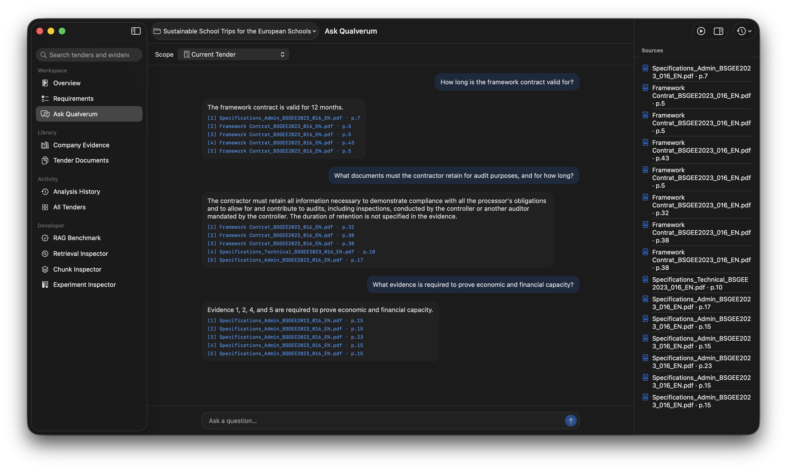

# Qualverum

Qualverum is a macOS application for exploring tender documents through an on-device Retrieval-Augmented Generation (RAG) pipeline built with Swift, Core ML, and Apple Foundation Models.

<p align="center">
  
</p>

## Overview

Tender documents are often long, dense, and difficult to review quickly. Important requirements, deadlines, contract terms, and supporting evidence can be buried across many pages.

Qualverum helps users explore these documents through document-grounded Q&A. Instead of searching manually through an entire tender, users can ask questions and receive answers backed by evidence retrieved from the original source.

To better support sensitive business documents, Qualverum is designed around an on-device RAG pipeline. Document processing, embeddings, retrieval, and generation stay local to the Mac, reducing the need to send tender content to external cloud services.

## Features

### Available

- Create and manage tender workspaces
- Import and store tender PDF documents locally
- Parse PDFs using PDFKit and Vision
- Preserve document structure during ingestion
- Structure-aware document chunking
- Parent-child chunk relationships
- On-device embedding generation with Core ML
- Persistent local vector indexing
- Dense Top-K retrieval
- Document-grounded Q&A
- Page-level source references
- Conversation context for follow-up questions
- Insufficient-evidence handling
- Adaptive context reduction when the generation context is too large

### Experimental

- Structured tender requirement extraction
- Requirement assessment and evidence mapping
- Additional chat scopes beyond the active tender
- Broader automated retrieval evaluation

## How It Works

```text
Tender PDF
    ↓
Document Ingestion & Chunking
    ↓
Embeddings
    ↓
Local Vector Index
    ↓
Dense Retrieval
    ↓
Context Construction
    ↓
Apple Foundation Models
    ↓
Grounded Answer
```

Qualverum extracts tender PDFs using PDFKit and Vision, preserves useful document structure during chunking, and generates embeddings on-device with Core ML. The resulting vectors are stored in a persistent local index.

When a user asks a question, Qualverum retrieves the most relevant chunks from the active tender and supplies them as evidence to Apple Foundation Models. The answer retains source references, and the pipeline can return an insufficient-evidence result when the retrieved context does not support an answer.

## Tech Stack

| Area | Technology |
| --- | --- |
| Language | Swift 6 |
| UI | SwiftUI |
| Generation | Apple Foundation Models |
| Embeddings | Core ML / EmbeddingGemma |
| PDF Processing | PDFKit |
| Document Recognition | Vision |
| Vector Storage & Search | VecturaKit |
| Model Integration | CoreML-LLM |
| RAG Pipeline | RAGCore |
| Persistence | Local file storage + persistent vector index |

## Architecture

Qualverum separates the macOS application from the reusable RAG pipeline.

```text
Qualverum App
    ↓
RAGService
    ↓
RAGCore
├── Document Ingestion
├── Chunking
├── Embeddings
├── Retrieval
├── Context
└── Generation
    ↓
RAGVectura
    ↓
Persistent Local Vector Index
```

- `Qualverum` contains the application UI, tender workflows, persistence, and chat experience.
- `RAGCore` contains the reusable document-processing and RAG components.
- `RAGVectura` connects the retrieval layer to VecturaKit for persistent local vector storage.

## Getting Started

### Requirements

- macOS 26 or later
- Xcode with Swift 6 support
- Apple Intelligence-compatible Mac
- Apple Foundation Models availability

### Run

1. Clone the repository.

```bash
git clone https://github.com/andeluw/qualverum.git
cd qualverum
```

2. Open `Qualverum.xcodeproj` in Xcode.
3. Resolve the Swift Package dependencies.
4. Build and run the `Qualverum` target.
5. Create a tender and import one or more PDF documents.
6. Wait for the documents to be processed and indexed.
7. Open Ask and query the active tender.

## Current Limitations

- Document-grounded chat currently operates on the active tender scope.
- Requirement extraction and assessment are not yet connected to the production RAG pipeline.
- Document structure recognition can vary depending on the PDF.
- Retrieval currently relies primarily on dense vector similarity.
- Retrieval relevance and generated-answer quality still require broader automated evaluation.
- Some workspace state, including chat and analysis state, is not yet persisted across launches.

## Status

Qualverum is under active development.

The current focus is building a reliable local RAG foundation before expanding into higher-level tender analysis workflows.

## License

Released under the [MIT License](LICENSE).